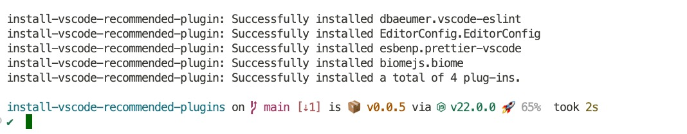

<h1 align="center">install-vscode-recommended-plugins</h1>
<p align="center">force installation of recommended plugins in .vscode/extensions.json</p>

<p align="center">
<a href="https://www.npmjs.com/package/install-vscode-recommended-plugins" target="__blank"></a>
<a href="https://www.npmjs.com/package/install-vscode-recommended-plugins" target="__blank"></a>
</p>

English | [简体中文](./README.zh_CN.md)



## Why

When working on a team project, it's crucial to maintain a consistent development environment. Visual Studio Code (VSCode) extensions play a vital role in enhancing productivity and enforcing coding standards. However, relying solely on .vscode/extensions.json to recommend extensions is insufficient since it doesn't enforce installation.

install-vscode-recommended-plugins solves this problem by automating the installation of recommended VSCode extensions listed in .vscode/extensions.json. With a single command, it ensures that all team members have the same set of extensions installed, promoting consistency and saving time.

In short, install-vscode-recommended-plugins streamlines the setup process, making it easier for developers to get started on a project and ensuring a consistent coding experience across the team.

## Usage

```ts
// package.json
 "scripts": {
    "postinstall": "npx install-vscode-recommended-plugins",
  },
```

When you install, the `postinstall` script is automatically executed, installing the recommended plugins in `.vscode/extensions.json`.

## License

[MIT](./LICENSE) License © 2024 [wChenonly](https://github.com/wChenonly)
