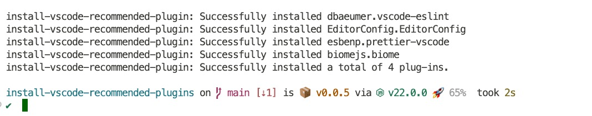

<h1 align="center">install-vscode-recommended-plugins</h1>
<p align="center">强制安装 .vscode/extensions.json 中推荐的插件</p>

<p align="center">
<a href="https://www.npmjs.com/package/install-vscode-recommended-plugins" target="__blank"></a>
<a href="https://www.npmjs.com/package/install-vscode-recommended-plugins" target="__blank"></a>
</p>

English | [简体中文](./README.zh_CN.md)



## 为什么

在团队项目中工作时，保持一致的开发环境至关重要。Visual Studio Code（VSCode）扩展在提高工作效率和执行编码标准方面发挥着至关重要的作用。然而，仅仅依靠 .vscode/extensions.json 来推荐扩展是不够的，因为它无法强制安装。

install-vscode-recommended-plugins 通过自动安装 .vscode/extensions.json 中列出的推荐 VSCode 扩展来解决这一问题。只需一条命令，它就能确保所有团队成员安装相同的扩展程序，从而提高一致性并节省时间。

简而言之，install-vscode-recommended-plugins 简化了安装过程，使开发人员更容易开始项目，并确保整个团队拥有一致的编码体验。

## 使用

```ts
// package.json
 "scripts": {
    "postinstall": "npx install-vscode-recommended-plugins",
  },
```

当你 install 之后，会自动执行 `postinstall` 脚本，安装 `.vscode/extensions.json` 中推荐的插件。

## 许可

[MIT](./LICENSE) License © 2024 [wChenonly](https://github.com/wChenonly)
